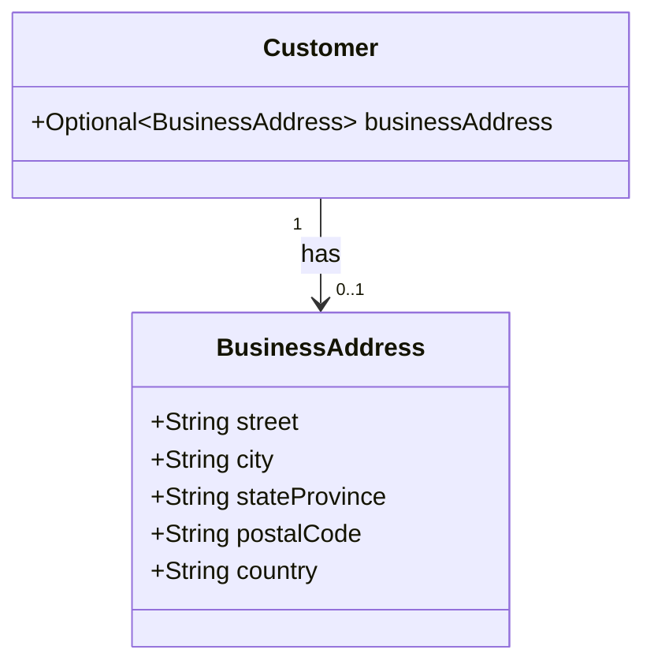
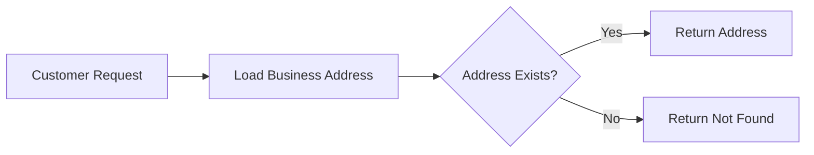
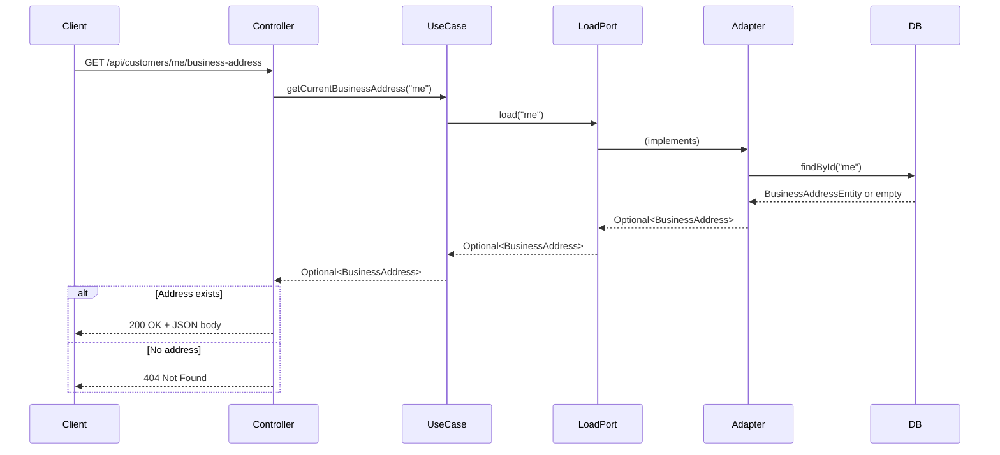
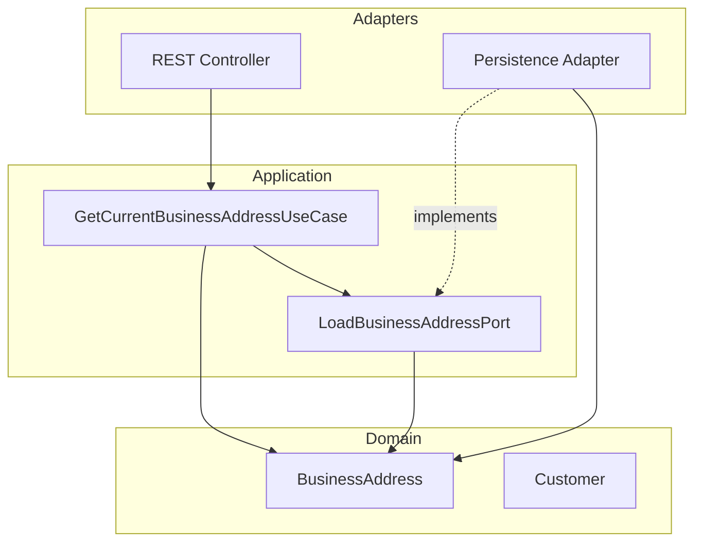
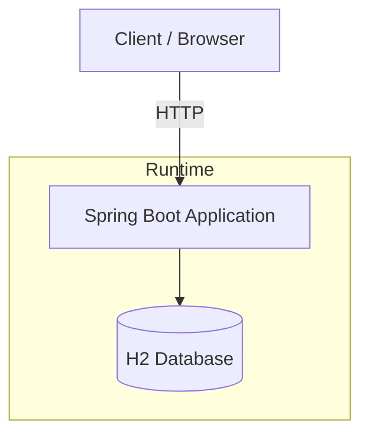

# Architecture: 4+1 View

This document describes the CRM Self-Service application architecture using the 4+1 view model (Kruchten). The "+1" (Scenarios) view ties the other four views together by illustrating how they work in practice.

---

## +1 Scenarios View

The Scenarios view describes use cases that drive the architecture and demonstrate how the system fulfills stakeholder needs.

### UC-001: Get Current Business Address

A customer requests their current business address. The system loads it from persistence and returns it, or returns not-found if no address exists.

| View | How the scenario is realized |
|------|------------------------------|
| **Logical** | Domain entities `BusinessAddress` and `Customer` represent the concept of a customer's address |
| **Process** | HTTP GET → Controller → Use Case → Load Port → Persistence Adapter → DB |
| **Development** | Hexagonal layers: REST adapter, application use case, persistence adapter |
| **Physical** | Single Spring Boot process; H2 database (in-memory for tests) |

**BDD scenario reference**: `business_address.feature`

---

## 1. Logical View

The Logical view shows the key abstractions and functional decomposition of the system.

### Domain Model



### Key Abstractions

| Concept | Description |
|---------|-------------|
| **BusinessAddress** | Value object representing a canonical business address with five mandatory fields |
| **Customer** | Entity holding an optional business address (one per customer) |

### Logical Flow: Get Current Business Address



---

## 2. Process View

The Process view describes the runtime behavior and flow of a request through the system.

### Request Flow: Get Current Business Address



### Process Summary

| Step | Component | Responsibility |
|------|-----------|----------------|
| 1 | REST Controller | Receives HTTP GET, resolves "me" to customer id, invokes use case |
| 2 | Use Case | Orchestrates; delegates to outbound port |
| 3 | Load Port | Interface; implemented by persistence adapter |
| 4 | Persistence Adapter | Maps domain ↔ entity, calls JPA repository |
| 5 | Database | Stores and retrieves business address by customer id |

---

## 3. Development View

The Development view shows the static structure of the software: packages, layers, and dependencies.

### Package Structure

```
com.example.app
├── domain/                      # Domain layer (innermost)
│   ├── BusinessAddress.java
│   └── Customer.java
├── application/                 # Application / use case layer
│   ├── GetCurrentBusinessAddressUseCase.java
│   ├── ApplicationConfig.java
│   └── port/
│       └── out/
│           ├── LoadBusinessAddressPort.java
│           └── SaveBusinessAddressPort.java
├── adapters/
│   ├── inbound/rest/            # Primary (driving) adapters
│   │   ├── GetCurrentBusinessAddressController.java
│   │   └── BusinessAddressResponse.java
│   └── outbound/persistence/    # Secondary (driven) adapters
│       ├── BusinessAddressPersistenceAdapter.java
│       ├── entity/BusinessAddressEntity.java
│       └── repository/BusinessAddressJpaRepository.java
└── Application.java
```

### Hexagonal Architecture (Dependency Rule)



**Dependency rule**: Dependencies point inward. Domain has no dependencies on application or adapters.

### Layer Responsibilities

| Layer | Responsibility |
|-------|----------------|
| **Domain** | Pure business concepts; no framework or I/O dependencies |
| **Application** | Use cases; define ports (interfaces) for outbound concerns |
| **Adapters (inbound)** | Translate external requests (HTTP) into use case invocations |
| **Adapters (outbound)** | Implement ports; translate between domain and persistence |

---

## 4. Physical View

The Physical view describes the deployment topology and runtime environment.

### Deployment Topology



### Components

| Component | Technology | Notes |
|-----------|------------|-------|
| **Application** | Spring Boot 3.3, Java 21 | Single process; embedded Tomcat |
| **Database** | H2 (in-memory) | `jdbc:h2:mem:appdb` for main; `jdbc:h2:mem:testdb` for tests |
| **API** | REST over HTTP | JSON request/response |

### Configuration

- **Main**: `application.properties` (H2 in-memory, Flyway migrations)
- **Test**: `application.properties` in test resources (separate H2 instance)

---

## References

- Use case specifications: [use-case-specifications.md](use-case-specifications.md)
- BDD scenarios: `src/test/resources/com/example/app/cucumber/business_address.feature`
- Practices guide: [practices-guide.md](practices-guide.md)
